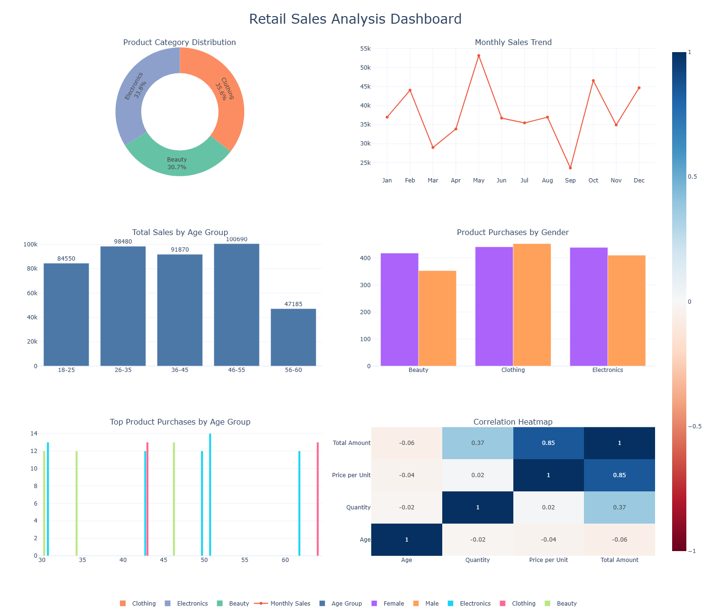
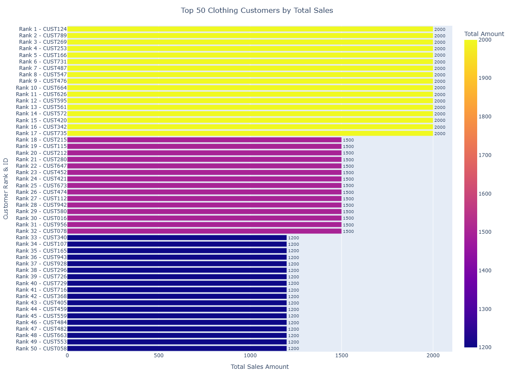
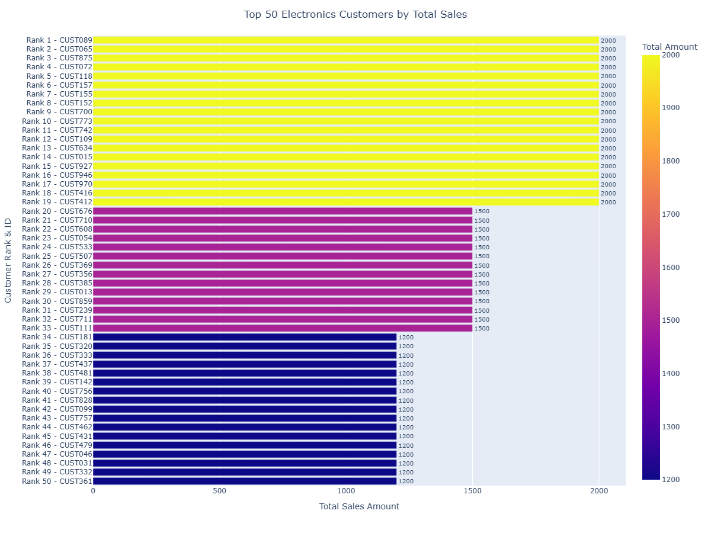
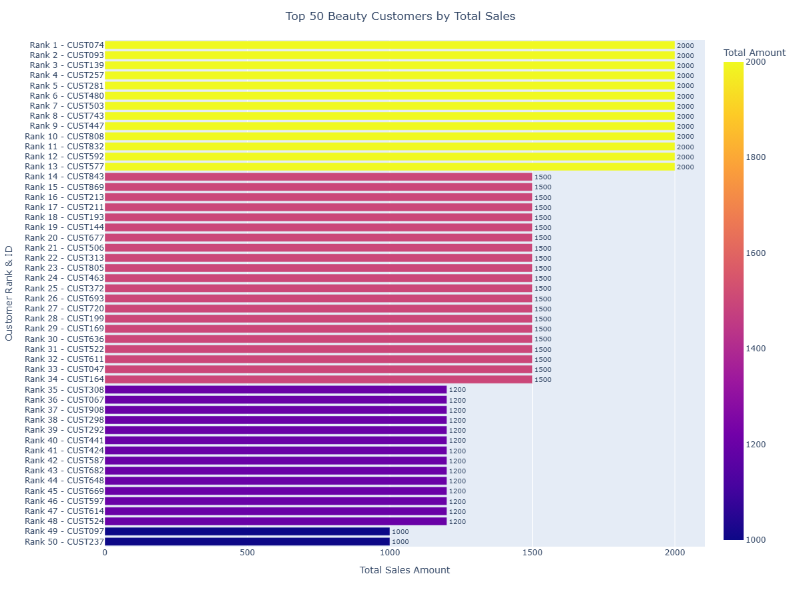

# 📊 Retail Sales Analysis

A comprehensive **Retail Sales Analysis** project built using **Python, Pandas, Matplotlib, Seaborn, and Plotly**.

This project explores retail transaction data to uncover customer purchasing behavior, product performance, sales trends, and revenue drivers through exploratory data analysis and interactive visualizations.

---

# 📁 Project Structure

```
Sales_Analysis/
│
├── docs/
│   ├── index.html                 # Interactive Plotly Dashboard
│   └── Sales_Report.html          # Interactive Data Profiling Report
│
├── images/
│   ├── Beauty.png
│   ├── Clothing.png
│   ├── Electronics.png
│   └── dashboard.png
│
├── Notebook/
│   └── Sales_Analysis.ipynb       # Complete data analysis notebook
│
├── Sales_dataset.csv              # Retail sales dataset
├── requirements.txt               # Required Python libraries
└── README.md
```

---

# 📌 Project Objectives

This project aims to answer important business questions such as:

- Which age group contributes the highest revenue?
- Which product category performs the best?
- How do purchasing patterns differ by gender?
- Which months generate the highest sales?
- Who are the top customers in each product category?
- What relationships exist between numerical variables?

---

# 📂 Dataset Information

The dataset contains retail transaction records with the following attributes.

| Column | Description |
|---------|-------------|
| Transaction ID | Unique transaction identifier |
| Date | Purchase date |
| Customer ID | Customer identifier |
| Gender | Customer gender |
| Age | Customer age |
| Product Category | Purchased category |
| Quantity | Units purchased |
| Price per Unit | Product price |
| Total Amount | Transaction amount |

---

# 🛠 Technologies Used

- Python
- Pandas
- NumPy
- Matplotlib
- Seaborn
- Plotly
- Jupyter Notebook
- ydata-profiling

---

# 🔍 Analysis Workflow

### Data Cleaning

- Checked missing values
- Verified data types
- Converted dates into datetime format
- Created Month and Age Group features

### Exploratory Data Analysis

Performed analysis using

- Bar Charts
- Count Plots
- Pie Charts
- Scatter Plots
- Heatmaps
- Interactive Plotly Charts

### Business Insights

Generated insights on

- Customer purchasing behavior
- Product demand
- Sales performance
- Revenue trends
- Customer segmentation

---

# 📊 Dashboard

An interactive dashboard was created using **Plotly**.

### Dashboard Preview



### Interactive Dashboard

Open the interactive dashboard here:https://esairajesh2-droid.github.io/Sales_Analysis/

**docs/index.html**

Report of the data using ydata_profiling.
https://esairajesh2-droid.github.io/Sales_Analysis/Sales_Report.html

---

# 📋 Data Profile Report

A detailed profiling report was generated before analysis.

The report includes:

- Dataset overview
- Missing value analysis
- Duplicate detection
- Statistical summary
- Feature distributions
- Correlation analysis

Open the report from:

```
Reports/Sales_Report.html
```

---

# 📈 Visualizations

### Top Customers - Clothing



### Top Customers - Electronics



### Top Customers - Beauty



---

# 📈 Key Findings

- Customers aged **26–55** generate the highest revenue.
- Clothing is the most frequently purchased product category.
- Female customers purchase more clothing than male customers.
- Monthly sales reveal clear seasonal trends.
- Price per Unit has the strongest positive relationship with Total Amount.
- Customer age has relatively little influence on spending.

---

# 💡 Business Recommendations

- Focus marketing on customers aged **26–55**.
- Maintain inventory for high-demand categories.
- Introduce promotions during low-sales months.
- Reward high-value customers through loyalty programs.
- Use customer purchase behavior for personalized recommendations.

---

# 🚀 Getting Started

### Clone the repository

```bash
git clone https://github.com/esairajesh2-droid/Sales_Analysis.git
```

### Navigate into the project

```bash
cd Sales_Analysis
```

### Install dependencies

```bash
pip install -r requirements.txt
```

### Launch Jupyter Notebook

```bash
jupyter notebook
```

Open

```
Notebook/Sales_Analysis.ipynb
```

---

# 📦 Requirements

Install all required libraries using

```bash
pip install -r requirements.txt
```

---

# 🔮 Future Improvements

- Sales Forecasting using Machine Learning
- Customer Segmentation (K-Means)
- Streamlit Dashboard
- Power BI Dashboard
- Automated Report Generation

---

# 👨‍💻 Author

**Earanki Sai Rajesh**

GitHub:

https://github.com/esairajesh2-droid

---

⭐ If you found this project useful, consider giving it a **Star**.
